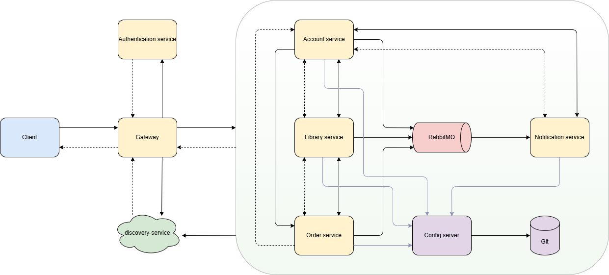

# Библиотека электронных книг с использованием микро-сервисной архитектуры

# Пользовательские сценарии:

## Схема взаимодействия сервисов:

## Назначение сервиса и его зона ответственности:
| Название сервиса       | Зона ответственности и назначение                                                           |
|------------------------|---------------------------------------------------------------------------------------------|
| Gateway                | API Gateway. Используется как точка входа и маршрутиризатор запросов от клиента.            |
| Discovery service      | Служба обнаружения. Реализация Netflix eureka                                               |
| Authentication service | Используется аутентификация в Keycloak.                                                     |
| Account service        | Работает с данными пользователей.                                                           |
| Library service        | Основной back-end. Является головным хранилищем книг и выполняет выдачу книг пользователям. |
| Order service          | Выполняет создание заказа на пополнение библиотеки.                                         |
| Notification service   | Выполняет отправку уведомлений на электронную почту пользователям.                          |
| Config server          | Хранение и распространение конфигураций приложений.                                         |
