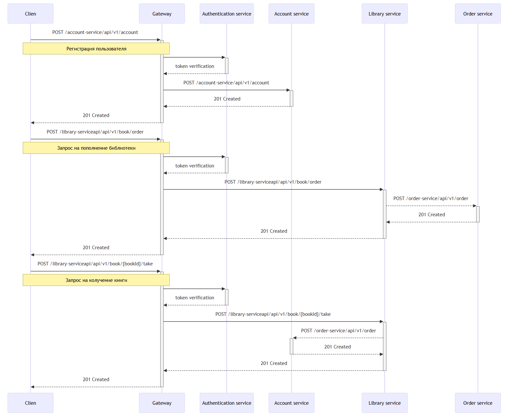

# Библиотека электронных книг с использованием микро-сервисной архитектуры

# Пользовательские сценарии:
- Пользователь регистрируется в личном кабинете.
- Пользователь запрашивает список книг, доступных в библиотеке.
- - Пользователь не находит интересующею книгу и оставляет запрос на пополнение библиотеки.
  - Книга добавляется в лист ожидания, направляется уведомление о заказе.
  - Книга добавляется в библиотеку, направляется уведомление о пополнение.
- Пользователь выбирает книгу, которую возьмет в библиотеке.
  - Книга резервируется за пользователем, направляется уведомление о получение книги.
- Пользователь выбирает книгу, и может оставить комментарий про книгу.
  - Направляется уведомление о комментарии.

## Схема взаимодействия сервисов:

## Назначение сервиса и его зона ответственности:
| Название сервиса       | Зона ответственности и назначение                                                           |
|------------------------|---------------------------------------------------------------------------------------------|
| Gateway                | API Gateway. Используется как точка входа и маршрутиризатор запросов от клиента.            |
| Discovery service      | Служба обнаружения. Реализация Netflix eureka                                               |
| Authentication service | Используется аутентификация в Keycloak.                                                     |
| Account service        | Работает с данными пользователей.                                                           |
| Library service        | Основной back-end. Является головным хранилищем книг и выполняет выдачу книг пользователям. |
| Order service          | Выполняет создание заказа на пополнение библиотеки.                                         |
| Notification service   | Выполняет отправку уведомлений на электронную почту пользователям.                          |
| Config server          | Хранение и распространение конфигураций приложений.                                         |

## Контракты взаимодействия (Sequence диаграмма):
